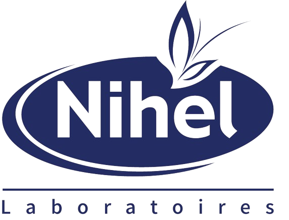
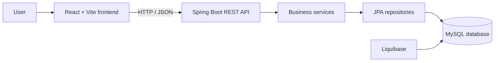

<div align="center">
  

  # Laboratory Project Management

  **A centralized platform for managing laboratory projects, formulas and resources.**

  <p>
    
    
    
    
    
  </p>
</div>

<p align="center">
  
</p>

<p align="center">
  <a href="#features">Features</a> ·
  <a href="#installation">Installation</a> ·
  <a href="#usage">Usage</a> ·
  <a href="#documentation">Documentation</a>
</p>

## About

**Laboratory Project Management** is a web application designed to organize and monitor laboratory activities. It brings projects, formulas, associated ingredients and user accounts into one workspace, with access rights adapted to each user's responsibilities.

The React interface communicates with a Spring Boot REST API, which centralizes business rules and persists data in MySQL.

## Features

| Area | Capabilities |
| --- | --- |
| Projects | Browse, search, filter by status, create and track project dates |
| Formulas | Create, edit and view formulas linked to projects |
| Ingredients | View and manage ingredients used in formulas |
| Accounts | Authenticate, create accounts and manage users |
| Access control | Role-based features for `ADMIN`, `RESPONSABLE_TECHNIQUE` and `CHEF_PROJET` |
| API | REST endpoints with interactive OpenAPI / Swagger documentation |
| Data | JPA / Hibernate persistence and Liquibase migrations |

## Architecture overview

The main workflow is straightforward: users interact with the frontend, the frontend consumes the REST API, and the business services validate and persist data in MySQL.



## Technology stack

### Backend

- Java 21 and Spring Boot 3.2
- Spring Web, Spring Data JPA and Hibernate
- MySQL and Liquibase
- Maven Wrapper
- Querydsl, Lombok and Springdoc OpenAPI

### Frontend

- React 18 and Vite
- React Router and Redux
- Axios
- Bootstrap, React Bootstrap and Font Awesome

## Project structure

```text
.
├── backend/
│   ├── src/main/java/       # Controllers, services, entities, DTOs and repositories
│   ├── src/main/resources/  # Configuration and Liquibase changelogs
│   └── pom.xml
├── frontend/
│   ├── src/                 # React pages, components and styles
│   ├── public/              # Logos and visual assets
│   └── package.json
├── docs/
│   ├── architecture.md     # Architecture notes
│   ├── assets/              # Documentation visuals
│   └── screenshots/         # Functional screenshots
├── .env.example             # Required variables without real secrets
├── .gitignore
└── LICENSE
```

Generated directories such as `target/`, `node_modules/`, `dist/` and `backend/bin/` are excluded from Git.

## Prerequisites

- JDK 21
- Node.js 18 or newer and npm
- MySQL 8 or newer
- Git

## Installation

### 1. Clone the repository

```bash
git clone <REPOSITORY_URL>
cd gestion-projet-labo
```

### 2. Prepare MySQL

```sql
CREATE DATABASE labo CHARACTER SET utf8mb4 COLLATE utf8mb4_unicode_ci;
```

### 3. Configure the environment

Use [.env.example](.env.example) as a template, set your local values, then export the variables in the runtime environment or configure them in your IDE. Spring Boot reads the variables referenced in [application.properties](backend/src/main/resources/application.properties).

> `.env` is local and must never be committed. Do not place passwords, API keys or tokens in the repository.

### 4. Install frontend dependencies

```bash
cd frontend
npm install
```

## Usage

<details>
<summary><strong>Start the backend</strong></summary>

From the `backend/` directory:

```bash
./mvnw spring-boot:run
```

On Windows:

```powershell
.\mvnw.cmd spring-boot:run
```

The API is available at `http://localhost:8080` by default.
</details>

<details>
<summary><strong>Start the frontend</strong></summary>

From the `frontend/` directory:

```bash
npm run dev
```

Vite then displays the local URL, usually `http://localhost:5173`.
</details>

### Useful commands

```bash
# Frontend
npm run build
npm run lint

# Backend
./mvnw test
```

When the backend is running, interactive OpenAPI documentation is available at `http://localhost:8080/swagger-ui.html`.

## Screenshots

Add functional screenshots to [docs/screenshots](docs/screenshots) when they are available. Logos and interface assets are stored in [frontend/public](frontend/public).

## Documentation

- [Architecture](docs/architecture.md)
- [Environment configuration](.env.example)
- [Interactive API documentation](http://localhost:8080/swagger-ui.html) after starting the backend

## Security

- Never commit `.env`, passwords, API keys or database credentials.
- Use [.env.example](.env.example) only with fictional values.
- If a secret is published, revoke it immediately and clean the Git history before making the repository public.

## Author

**Laboratory Project Team**

## License

Distributed under the MIT License. See [LICENSE](LICENSE).